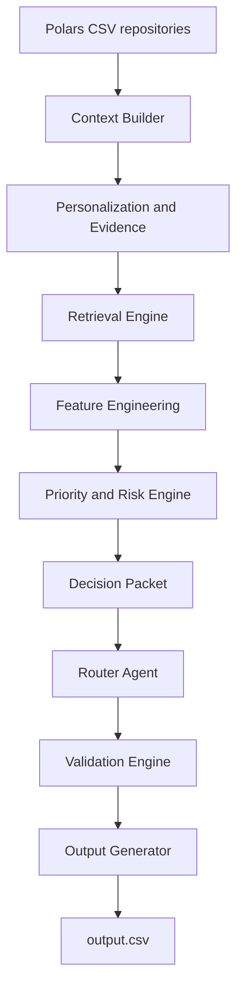
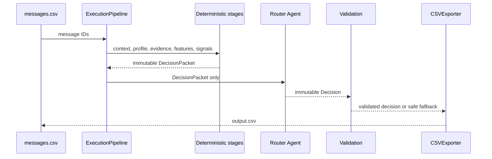

# Cortex Notify

Cortex Notify is a deterministic, memory-aware WhatsApp notification router. It processes each incoming message and produces `notify`, `digest`, or `mute`, plus type, explanation, confidence, and evidence IDs.

The complete local path is:

```text
dataset/messages.csv → output.csv
```

## Architecture



Repositories are the only dataset-access layer. Later deterministic stages consume typed immutable models. The Router Agent receives only `DecisionPacket` and cannot access repositories, retrieval, feature engineering, media files, or raw CSV data.

## Pipeline



## Installation

Requirements: Python 3.12 and `uv`.

```powershell
uv sync --extra dev
uv run pre-commit install
```

Docker:

```powershell
docker compose build
docker compose run --rm router health
```

## Quick start

```powershell
uv run orchestrate run --output output.csv
```

The output uses exactly: `message_id,action,message_type,reason,confidence,evidence_message_ids`.

## CLI

```text
orchestrate health       # configuration and path checks
orchestrate run          # execute and export output.csv
orchestrate evaluate     # execute and print metrics
orchestrate benchmark    # batch performance metrics
orchestrate validate     # execute without writing output
orchestrate export       # execute and export the official CSV
orchestrate profile      # stage and memory metrics
```

## Configuration

Settings use the `ORCHESTRATE_` environment prefix and `.env` support. Dataset paths default to `dataset/*.csv` and can be overridden individually.

```powershell
$env:ORCHESTRATE_DATA_DIRECTORY = "dataset"
$env:ORCHESTRATE_LOG_LEVEL = "INFO"
$env:ORCHESTRATE_CONTEXT_HISTORY_LIMIT = "50"
```

The local composition uses the deterministic Mock provider. Production provider transports are injectable and secrets are never hardcoded.

## Evaluation and benchmarking

```powershell
uv run python code/evaluation/main.py
uv run python scripts/benchmark_pipeline.py
uv run python scripts/benchmark_retrieval.py
uv run python scripts/benchmark_features.py
uv run python scripts/evaluate_router.py
```

## Testing

```powershell
uv run ruff check .
uv run ruff format --check .
uv run mypy app pipeline router orchestration priority features personalization context repositories retrieval
uv run pytest
uv run python -m compileall app api config context features media models orchestration ocr personalization pipeline priority reasoning repositories retrieval router speech utils validation scripts
```

## Project structure

```text
app/              settings, logging, DI, CLI, domain models
repositories/     Polars-backed read-only CSV adapters
context/          MessageContext construction
personalization/  deterministic profiles and evidence metadata
retrieval/        isolated vector, embedding, reranking, and retriever ports
features/         deterministic DecisionFeatures
priority/         compact DecisionSignals
orchestration/    immutable DecisionPacket and trace
router/           single provider-agnostic Router Agent
pipeline/         validation, batching, metrics, and CSV export
code/evaluation/  visible-fixture evaluation reports
docs/             phase guides, ADRs, reports, and operations notes
tests/            unit, integration, and end-to-end tests
```

## Design philosophy

Everything except the narrow Router Agent boundary is deterministic. Immutable Pydantic models make stage contracts explicit. Evidence and metadata preserve explainability. Provider, vector-store, and repository ports keep infrastructure replaceable. Validation occurs before output, and failures use a safe mute fallback rather than silently producing corrupt rows.

## Production considerations

Use a configured provider adapter for live routing, keep secrets in environment or a secret manager, monitor validation failures and confidence calibration, and retain trace IDs for incident analysis. The current output is reproducible with the local Mock provider and frozen dataset. Parallel batch processing remains behind the existing `BatchProcessor` boundary.

## Future work

The architecture is frozen for this submission. Further accuracy work should use matched hidden-like labels and controlled offline experiments without bypassing stage contracts.
