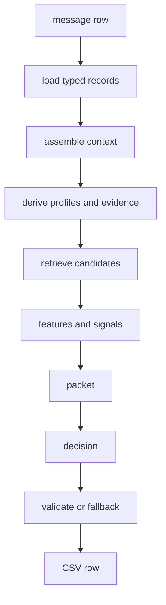
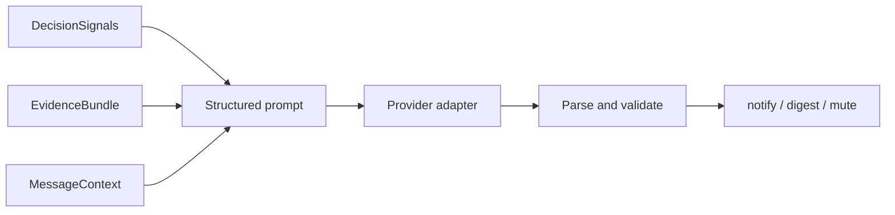
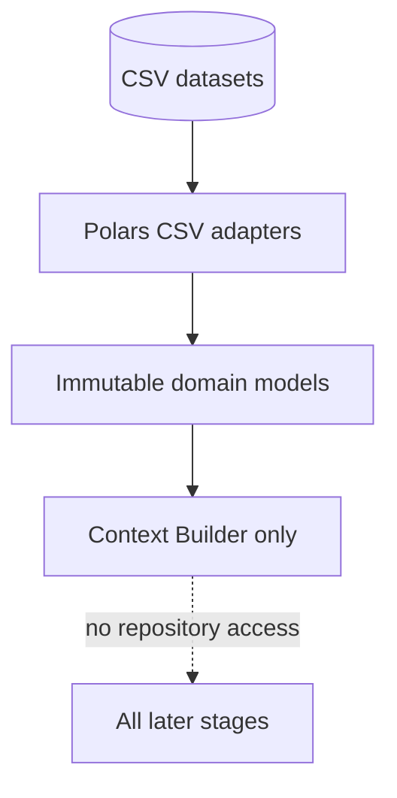
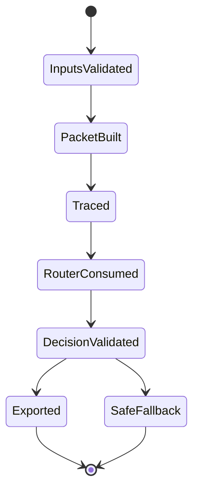
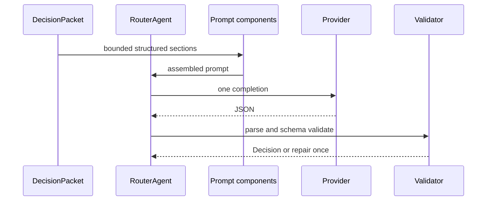

# Cortex Notify Architecture Diagrams

## Overall architecture

```mermaid
flowchart LR
    Repo[Repositories] --> Context[Context Builder]
    Context --> Personal[Personalization]
    Personal --> Retrieval[Retrieval]
    Retrieval --> Features[Feature Engineering]
    Features --> Priority[Priority and Risk]
    Priority --> Packet[DecisionPacket]
    Packet --> Router[Router Agent]
    Router --> Validate[Validation]
    Validate --> Export[Output Generator]
```

## Pipeline

```mermaid
flowchart TD
    Input[message row] --> Load[load typed records]
    Load --> Assemble[assemble context]
    Assemble --> Enrich[derive profiles and evidence]
    Enrich --> Retrieve[retrieve candidates]
    Retrieve --> Score[features and signals]
    Score --> Packet[packet]
    Packet --> Decide[decision]
    Decide --> Check[validate or fallback]
    Check --> CSV[CSV row]
```

## Decision flow

```mermaid
flowchart LR
    Signals[DecisionSignals] --> Prompt[Structured prompt]
    Evidence[EvidenceBundle] --> Prompt
    Context[MessageContext] --> Prompt
    Prompt --> Provider[Provider adapter]
    Provider --> Parse[Parse and validate]
    Parse --> Action[notify / digest / mute]
```

## Repository boundaries

```mermaid
flowchart TB
    CSV[(CSV datasets)] --> Adapter[Polars CSV adapters]
    Adapter --> Domain[Immutable domain models]
    Domain --> Context[Context Builder only]
    Context -. no repository access .-> Later[All later stages]
```

## DecisionPacket lifecycle

```mermaid
stateDiagram-v2
    [*] --> InputsValidated
    InputsValidated --> PacketBuilt
    PacketBuilt --> Traced
    Traced --> RouterConsumed
    RouterConsumed --> DecisionValidated
    DecisionValidated --> Exported
    DecisionValidated --> SafeFallback
    Exported --> [*]
    SafeFallback --> [*]
```

## Router flow

```mermaid
sequenceDiagram
    participant P as DecisionPacket
    participant A as RouterAgent
    participant T as Prompt components
    participant L as Provider
    participant V as Validator
    P->>T: bounded structured sections
    T->>A: assembled prompt
    A->>L: one completion
    L-->>A: JSON
    A->>V: parse and schema validate
    V-->>A: Decision or repair once
```
